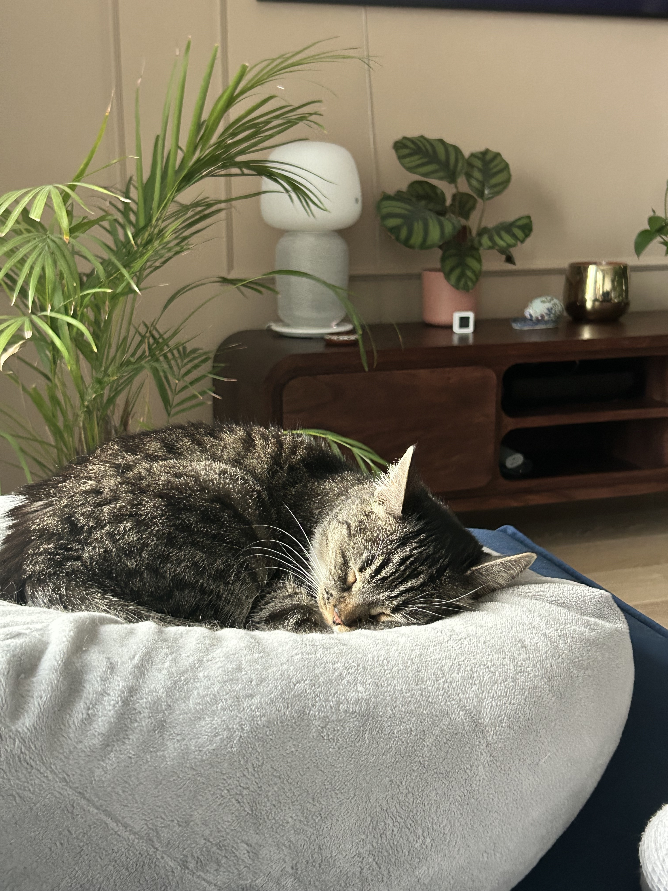

Technical writers have to work with SMEs to create documentation. A subject-matter expert, as the name suggests, is an expert in a particular field and some might be more difficult to work with than others.

Here are some tips that might help you reach an unresponsive SME:

1. Put yourself in their shoes

If they seem unresponsive it might have nothing to do with you. Maybe they are swamped or maybe they’ve simply forgotten to write back. 
If that happened to you, how would you like the other person to handle it? Become irritated and escalate? Probably not. Contact them again to schedule a meeting and be assertive. Maybe give them a couple of dates to choose from?

2. Don’t wait until the last minute

Since they have deadlines of their own, meeting with you might seem like an extra bit of work, so contact them in advance. Inform them what the timeline is so you can both plan accordingly, and let them know what you need help with.

3. Show interest and come prepared

Find out as much as possible about the subject. Prepare your questions ahead of time, and maybe even send them to the SME before the meeting. It gives them a chance to prepare and shows that you take it seriously. If you both come prepared for the meeting, you might actually save some time!

4. Small Talk 

Once you manage to make the first meeting happen try to get to know your SME. How? Small talk! It is often overlooked but small talk is a very powerful tool. It helps break the ice and find common ground. Who knows, you might even share some intrests. 

If small talk is not your strongest suit here are some articles that might help:

https://www.forbes.com/sites/christinapark/2015/03/30/an-introverts-guide-to-small-talk-eight-painless-tips/

Good luck!